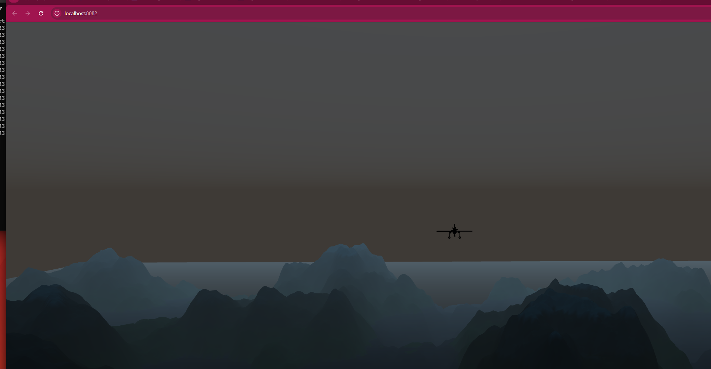

# Flight Simulator

A browser-based 3D flight simulator built with Three.js featuring procedural terrain generation, realistic flight physics, dynamic weather systems, and a full heads-up display (HUD). Fly a jet aircraft over an infinite procedurally generated landscape and try to land on the runway.



---

## About

### What does this project do?
This is a fully interactive 3D flight simulator that runs entirely in the browser. It features a physics-based flight model with lift, drag, thrust, and gravity calculations, procedurally generated infinite terrain with altitude-based coloring (water, grassland, forests, rocky mountains, snow caps), a dynamic sky system with day/night cycles and weather changes, and a complete HUD inspired by real aircraft cockpit instruments.

### Why was it built?
Flight simulation combines multiple complex software engineering disciplines — real-time 3D rendering, physics simulation, procedural content generation, user input handling, and HUD/UI design — into a single interactive application. This project demonstrates the ability to architect and implement a modular, performance-critical application with zero external dependencies beyond Three.js, making it an ideal portfolio piece for aerospace-related software engineering roles.

### Technologies Used
- **Three.js** (v0.170.0) — 3D rendering engine (loaded via CDN, zero install)
- **WebGL** — Hardware-accelerated graphics via browser
- **Web Audio API** — Procedural sound effects (stall warnings, crash sounds, engine failure)
- **Simplex Noise** — Procedural terrain generation using fractal Brownian motion (fBm)
- **ES Modules** — Modern JavaScript module architecture
- **HTML5 / CSS3** — HUD overlay with cockpit-style instruments

---

## Quick Start (2 Steps)

```bash
# 1. Start a local server (Python 3 required for ES module imports)
cd flight-simulator
python -m http.server 8082

# 2. Open in browser
# Navigate to http://localhost:8082
```

> **Why a local server?** The project uses ES module imports (`import ... from 'three'`), which browsers block when opened via `file://` protocol due to CORS security. A local HTTP server resolves this.

---

## Prerequisites

| Requirement | Version | Check Command | Install |
|---|---|---|---|
| **Web Browser** | Chrome, Firefox, Edge (with WebGL) | — | — |
| **Python 3** | 3.7+ | `python --version` | [python.org/downloads](https://www.python.org/downloads/) |

> **Alternative servers:** `npx serve .` (Node.js), VS Code Live Server extension, or any static HTTP server.

---

## Step-by-Step Setup Guide

### 1. Clone or Download

```bash
git clone https://github.com/zeynepsusosun/flight-simulator.git
cd flight-simulator
```

Or download ZIP from the repository page and extract.

### 2. Start Local Server

```bash
python -m http.server 8082
```

You should see:
```
Serving HTTP on :: port 8082 (http://[::]:8082/) ...
```

> **Port busy?** Use any available port: `python -m http.server 9000`

> **Windows:** If `python` doesn't work, try `python3` or `py`.

### 3. Open the Simulator

Navigate to `http://localhost:8082` in your browser. Wait for the loading bar to complete.

### 4. Start Flying

Press `?` to close the controls help overlay and start flying. Use `Shift` to increase throttle and `W/S/A/D` to control the aircraft.

### 5. Land on the Runway

Follow the compass indicator (bottom-right) to find the runway. Reduce speed, lower gear (`G`), and land gently!

---

## Controls

| Key | Action |
|---|---|
| `W` / `S` | Pitch Down / Pitch Up |
| `A` / `D` | Roll Left / Roll Right |
| `Q` / `E` | Yaw Left / Yaw Right |
| `Shift` / `Ctrl` | Throttle Up / Throttle Down |
| `1` / `2` / `3` | Chase Cam / Cockpit Cam / Free Cam |
| `G` | Toggle Landing Gear |
| `R` | Reset Position |
| `H` | Toggle HUD |
| `P` / `Esc` | Pause |
| `F` | Fullscreen |
| `?` | Toggle Controls Help |

---

## Features

### Flight Physics
- Lift, drag, thrust, and gravity forces calculated per frame
- Angle of Attack (AoA) based lift coefficient with stall modeling
- Stall buffeting effect with random acceleration perturbation
- G-force calculation from vertical acceleration
- Speed-dependent control authority (controls become less responsive at low speeds)
- Engine ceiling at 3000m altitude (engine failure triggers glide mode)
- Ground collision detection with crash/gentle landing logic

### Procedural Terrain
- Infinite terrain generated using Simplex noise with 6 octaves of fractal Brownian motion (fBm)
- Chunk-based loading/unloading system (512m chunks, 64-segment resolution)
- Altitude-based vertex coloring: water → grassland → forest → brown hills → rocky → snow
- Dynamic chunk management following aircraft position
- Water plane with transparency

### Sky & Weather System
- Dynamic day/night cycle (5-minute full cycle)
- 4 weather types: Clear, Cloudy, Foggy, Stormy
- 4 seasons affecting weather probability distribution
- Three.js Sky shader with adjustable turbidity, Rayleigh scattering, and Mie coefficient
- 200 instanced cloud sprites with drift animation
- Rain particle system (3000 particles) during storms
- Dynamic fog density based on weather and time of day
- Directional light with shadow mapping follows sun position

### HUD (Heads-Up Display)
- Speed tape (knots) with stall speed warning
- Altitude tape (feet) with low altitude warning
- Heading indicator with cardinal directions
- Artificial horizon with pitch ladder and bank angle
- Throttle gauge with percentage
- Vertical speed, G-force, Mach number, FPS counter
- Waypoint compass (GTA-style) pointing to runway with distance
- Time and weather display
- Stall, ground proximity, altitude, and engine failure warnings

### Camera System
- **Chase Camera** — Smooth follow behind aircraft with lerp damping
- **Cockpit Camera** — First-person view with wider FOV
- **Free Camera** — Orbit controls for cinematic views
- Smooth transitions between camera modes

### Audio System
- Procedural sound effects using Web Audio API oscillators
- Stall warning beeps, ground proximity alert, altitude warning
- Crash and engine failure sounds
- Landing success jingle
- No external audio files required

### Runway & Landing
- Runway with center line markings, threshold markings, and edge lights
- Green/red edge lights indicating runway sections
- PAPI approach slope indicator lights
- Windsock with wind animation
- Pulsing beacon for long-range visibility
- Landing detection: requires correct speed, altitude, pitch, roll, and gear status

---

## Architecture

```
flight-simulator/
├── index.html          # Entry point — canvas, HUD elements, loading screen
├── css/
│   └── style.css       # HUD styling, warnings, game over screens, responsive
├── js/
│   ├── main.js         # App controller — init, game loop, event routing
│   ├── aircraft.js     # Flight physics, forces, collision, aircraft mesh
│   ├── terrain.js      # Simplex noise, chunk generation, height sampling
│   ├── sky.js          # Sky shader, day/night, weather, clouds, rain
│   ├── controls.js     # Keyboard input, throttle, key bindings
│   ├── camera.js       # Chase/cockpit/free camera modes, transitions
│   ├── hud.js          # HUD element updates, instruments, warnings
│   ├── runway.js       # Runway mesh, lights, landing detection, compass
│   └── audio.js        # Web Audio API procedural sounds
├── README.md           # This file
└── .gitignore          # Git ignore rules
```

### Module Dependency Graph
```
main.js
  ├── terrain.js    (Simplex noise + chunk system)
  ├── aircraft.js   (physics engine) ← terrain.js (ground height)
  ├── sky.js        (weather + lighting)
  ├── controls.js   (input) → aircraft.js
  ├── camera.js     (3 modes) → aircraft.js
  ├── hud.js        (instruments) → aircraft.js
  ├── runway.js     (landing target) ← terrain.js (ground height)
  └── audio.js      (sound effects)
```

---

## Screenshots


*Chase camera view with HUD overlay showing speed, altitude, heading, and artificial horizon*


*First-person cockpit camera with full instrument display*


*Approaching the runway with compass navigation and edge lights visible*


*Dynamic weather system showing stormy conditions with rain particles*

---

## Troubleshooting

| Problem | Solution |
|---|---|
| Blank screen / module error | Must use HTTP server, not `file://`. Run `python -m http.server 8082` |
| Low FPS / lag | Reduce browser window size, close other tabs, ensure hardware acceleration is enabled |
| No sound | Click anywhere on the page first (browsers require user interaction for audio) |
| Controls not responding | Click on the simulator window to focus it, then close help panel with `?` |
| `python` not found | Try `python3` or `py`, or install from [python.org](https://www.python.org/downloads/) |

---

## Future Improvements

- [ ] Multiple aircraft models (propeller, commercial jet, helicopter)
- [ ] Multiplayer via WebSocket
- [ ] Realistic airport environments with terminal buildings
- [ ] ATC (Air Traffic Control) voice simulation
- [ ] Flight recording and replay
- [ ] Gamepad/joystick support
- [ ] Terrain biomes (desert, arctic, tropical)
- [ ] Night lighting with city lights below

---

## Author

**Zeynep Su Sosun** — Software Engineering Student, Near East University

- GitHub: [github.com/zeynepsusosun](https://github.com/zeynepsusosun)
- LinkedIn: [linkedin.com/in/zeynep-su-sosun-65ab28296](https://www.linkedin.com/in/zeynep-su-sosun-65ab28296)

---

## License

This project is for educational and portfolio purposes. Built with [Three.js](https://threejs.org/) (MIT License).
